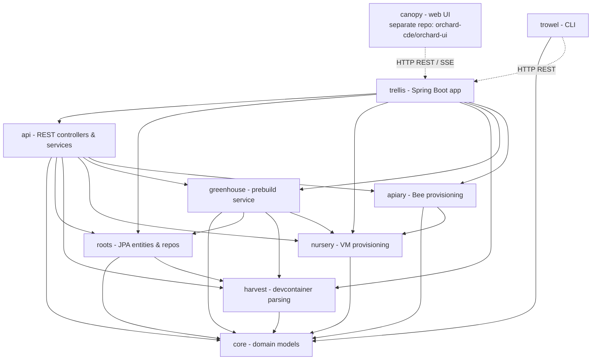
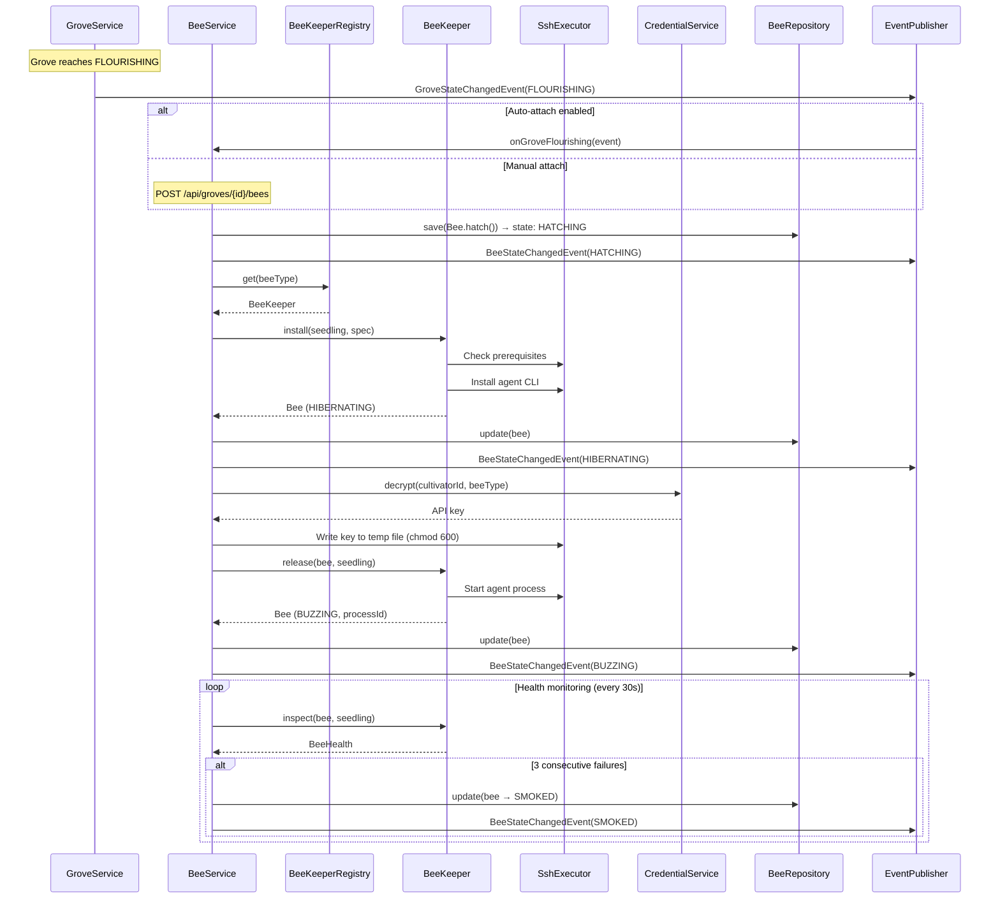
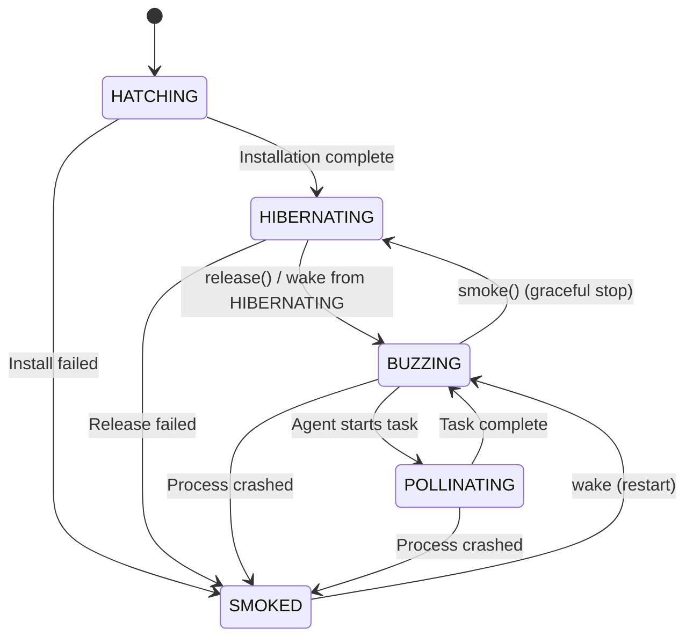
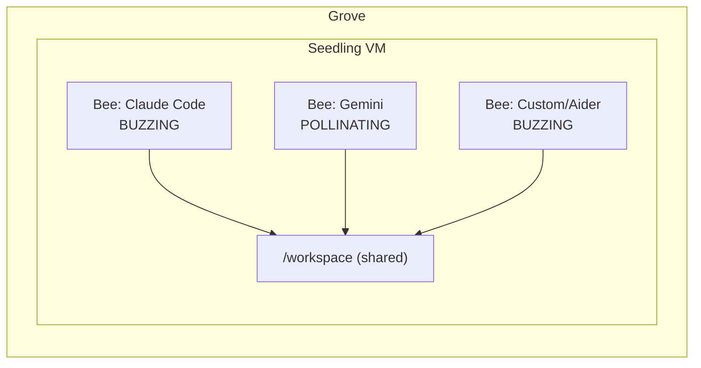
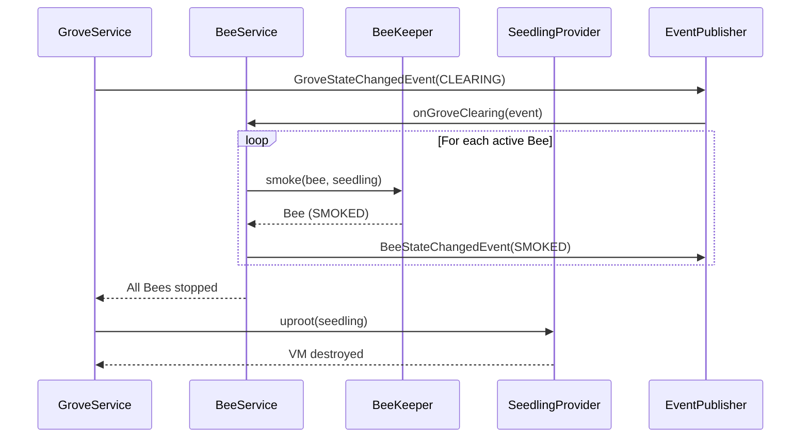
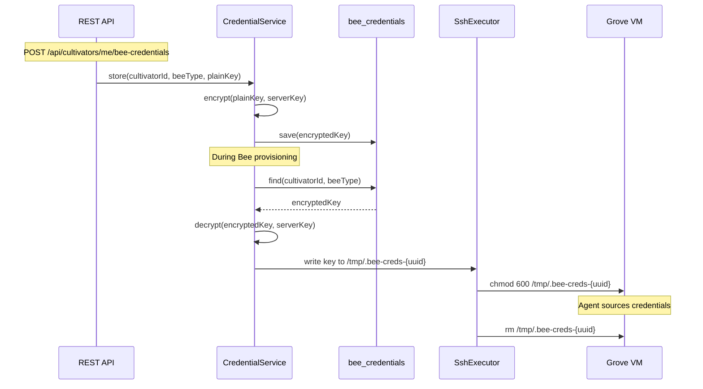

# Bee Architecture — Agent Integration for Orchard Groves

This document describes the architecture of the Bee subsystem, which enables coding agents to run inside Orchard Groves. Bees are provisioned via SSH into the Grove's VM, managed by BeeKeeper adapters, and support concurrent execution (swarming).

For the themed naming glossary, see [README.md](../../README.md#themed-glossary).

**Additional terminology:**

| Term | Meaning |
|------|---------|
| **Bee** | A coding agent instance running inside a Grove |
| **BeeKeeper** | Adapter that installs, configures, and manages a specific agent CLI |
| **Apiary** | New module (`apiary/`) housing Bee provisioning logic |
| **Swarming** | Multiple Bees running concurrently in the same Grove |

---

## 1. Module Dependency Graph



**Key**: Solid arrows are compile-time module dependencies. Dashed arrows are runtime network communication. The `apiary` module depends on `core` (domain models) and `nursery` (for `SshExecutor`). Canopy is a separate Next.js application in the [`orchard-cde/orchard-ui`](https://github.com/orchard-cde/orchard-ui) repository.

---

## 2. BeeKeeper Interface

Defined in `apiary/src/main/java/dev/orchard/apiary/BeeKeeper.java`:

```java
public interface BeeKeeper {
    String getBeeType();
    CompletableFuture<Bee> install(Seedling seedling, BeeSpec spec);
    CompletableFuture<Bee> release(Bee bee, Seedling seedling);
    CompletableFuture<Bee> smoke(Bee bee, Seedling seedling);
    CompletableFuture<BeeHealth> inspect(Bee bee, Seedling seedling);
    List<String> prerequisites();
}
```

All operations return `CompletableFuture` for non-blocking async execution, following the `SeedlingProvider` pattern.

| Method | Purpose | State Transition |
|--------|---------|-----------------|
| `install()` | SSH into VM, verify prerequisites, install agent CLI | HATCHING → HIBERNATING |
| `release()` | Start the agent process, return Bee with processId | HIBERNATING → BUZZING |
| `smoke()` | Stop the agent process gracefully | → HIBERNATING |
| `inspect()` | Health check, return BeeHealth status | (no transition) |
| `prerequisites()` | List required software (e.g., `["node>=18"]`) | (no transition) |

### 2.1 BeeKeeperRegistry

`apiary/src/main/java/dev/orchard/apiary/BeeKeeperRegistry.java`:
- Stores BeeKeepers in a `ConcurrentHashMap<String, BeeKeeper>` keyed by bee type string
- Methods: `register(BeeKeeper)`, `get(String type)`, `getAll()`
- Follows `ProviderRegistry` pattern from `nursery/`

### 2.2 Available BeeKeepers

| BeeKeeper | Type ID | Install Command | Prerequisites | Config Env |
|-----------|---------|-----------------|---------------|------------|
| Claude Code | `claude-code` | `npm install -g @anthropic-ai/claude-code` | Node.js 18+ | `ANTHROPIC_API_KEY` |
| Gemini CLI | `gemini` | npm package (TBD) | Node.js 18+ | `GOOGLE_API_KEY` |
| Codex | `codex` | npm package (TBD) | Node.js 18+ | `OPENAI_API_KEY` |
| Kiro CLI | `kiro` | `curl -fsSL https://cli.kiro.dev/install \| bash` | macOS/Linux | TBD |
| Custom | `custom` | User-provided | User-specified | User-provided env vars |

BeeKeepers are registered as Spring beans in `trellis/src/main/java/dev/orchard/trellis/config/ApiaryConfig.java`, following the `NurseryConfig` pattern. Agent-specific adapters use `@ConditionalOnProperty` for optional registration.

---

## 3. Bee Provisioning Flow



---

## 4. Bee State Machine



| State | Meaning |
|-------|---------|
| `HATCHING` | Bee is being installed and configured on the VM |
| `HIBERNATING` | Agent CLI is installed but process is not running |
| `BUZZING` | Agent process is running and idle/ready |
| `POLLINATING` | Agent is actively working on a task |
| `SMOKED` | Error state — process crashed, became unresponsive, or install failed |

---

## 5. Domain Models

All domain objects are Java records with factory methods, following the existing `core/` patterns.

**Bee:**
```java
public record Bee(
    UUID id,
    UUID groveId,
    BeeType type,
    BeeState state,
    BeeSpec spec,
    String processId,
    Instant hatchedAt,
    Instant startedAt,
    Instant stoppedAt
) {
    public static Bee hatch(UUID groveId, BeeSpec spec) { /* HATCHING state */ }
    public Bee withState(BeeState state) { /* ... */ }
    public Bee withProcessId(String processId) { /* ... */ }
    public boolean isActive() { return state == BUZZING || state == POLLINATING; }
}
```

**BeeState:**
```java
public enum BeeState {
    HATCHING,      // Being installed
    HIBERNATING,   // Installed, not running
    BUZZING,       // Running, idle
    POLLINATING,   // Running, working
    SMOKED         // Error
}
```

**BeeType:**
```java
public enum BeeType {
    CLAUDE_CODE("claude-code"),
    GEMINI("gemini"),
    CODEX("codex"),
    KIRO("kiro"),
    CUSTOM("custom");

    private final String value;
    BeeType(String value) { this.value = value; }
    public String value() { return value; }
}
```

**BeeSpec:**
```java
public record BeeSpec(
    BeeType type,
    String version,
    Map<String, String> configOverrides
) {}
```

**BeeHealth:**
```java
public record BeeHealth(
    boolean alive,
    boolean responsive,
    String currentActivity,
    Instant lastCheckedAt
) {}
```

---

## 6. Database Schema

New Flyway migration (V6) in `roots/src/main/resources/db/migration/`:

**`bees` table:**

| Column | Type | Constraints |
|--------|------|-------------|
| `id` | UUID | PK |
| `grove_id` | UUID | FK → groves, NOT NULL |
| `bee_type` | VARCHAR | NOT NULL |
| `state` | VARCHAR | NOT NULL |
| `process_id` | VARCHAR | nullable |
| `config` | JSONB | nullable |
| `hatched_at` | TIMESTAMP WITH TIME ZONE | NOT NULL |
| `started_at` | TIMESTAMP WITH TIME ZONE | nullable |
| `stopped_at` | TIMESTAMP WITH TIME ZONE | nullable |

**`bee_preferences` table:**

| Column | Type | Constraints |
|--------|------|-------------|
| `cultivator_id` | UUID | FK → cultivators, UNIQUE |
| `default_bee_type` | VARCHAR | nullable |
| `auto_attach` | BOOLEAN | DEFAULT false |
| `config` | JSONB | nullable |

**`bee_credentials` table:**

| Column | Type | Constraints |
|--------|------|-------------|
| `id` | UUID | PK |
| `cultivator_id` | UUID | FK → cultivators |
| `bee_type` | VARCHAR | NOT NULL |
| `encrypted_key` | TEXT | NOT NULL |
| `created_at` | TIMESTAMP WITH TIME ZONE | NOT NULL |
| | | UNIQUE(cultivator_id, bee_type) |

**Repositories:**
- `BeeRepository extends CrudRepository<BeeEntity, UUID>` — `findByGroveId(UUID)`
- `BeePreferencesRepository extends CrudRepository<BeePreferencesEntity, UUID>` — `findByCultivatorId(UUID)`
- `BeeCredentialRepository extends CrudRepository<BeeCredentialEntity, UUID>` — `findByCultivatorIdAndBeeType(UUID, String)`

---

## 7. REST API

### 7.1 Bee Management

| Method | Path | Purpose | Notes |
|--------|------|---------|-------|
| POST | `/api/groves/{id}/bees` | Attach a Bee | Grove must be FLOURISHING |
| GET | `/api/groves/{id}/bees` | List all Bees in a Grove | |
| GET | `/api/groves/{id}/bees/{beeId}` | Get Bee status | |
| DELETE | `/api/groves/{id}/bees/{beeId}` | Stop and remove a Bee | Calls smoke(), deletes record |
| POST | `/api/groves/{id}/bees/{beeId}/actions/wake` | Restart a Bee | Valid from HIBERNATING or SMOKED → BUZZING |
| GET | `/api/groves/{id}/bees/swarm-status` | Summary of all active Bees | |

**DTOs:**
```java
record CreateBeeRequest(String beeType, String version, Map<String, String> configOverrides) {}

record BeeResponse(UUID id, UUID groveId, String type, String state,
                   Instant hatchedAt, Instant startedAt, Instant stoppedAt) {
    static BeeResponse fromModel(Bee bee) { /* ... */ }
}

record SwarmStatusResponse(UUID groveId, int totalBees, int activeBees,
                           List<BeeResponse> bees) {}
```

### 7.2 Cultivator Preferences

Uses `/me` to resolve cultivator from auth context, preventing unauthorized access:

| Method | Path | Purpose |
|--------|------|---------|
| GET | `/api/cultivators/me/bee-preferences` | Get agent defaults |
| PUT | `/api/cultivators/me/bee-preferences` | Set agent defaults |
| POST | `/api/cultivators/me/bee-credentials` | Store encrypted API key |
| DELETE | `/api/cultivators/me/bee-credentials/{type}` | Remove an API key |

**Security:** API never returns decrypted keys. GET for credentials returns only type + createdAt.

---

## 8. Swarming

Multiple Bees can be attached to a single Grove simultaneously. Each Bee:
- Has its own independent agent process
- Has its own credentials and configuration
- Operates on the same filesystem (the Grove's `/workspace`)
- Transitions states independently

The swarm-status endpoint provides a consolidated view of all Bees in a Grove.



**Concurrency note:** File-level conflicts between concurrent Bees are not prevented in v1. Cultivators should assign distinct tasks or subdirectories to each Bee. Future work may include workspace sandboxing via git worktrees or overlay filesystems.

---

## 9. Grove Lifecycle Integration

When a Grove transitions to CLEARING, all Bees must be stopped before the Seedling is uprooted:



This ensures agent processes are cleanly terminated before the VM is destroyed.

---

## 10. Event Integration

New event: `BeeStateChangedEvent`

```java
public record BeeStateChangedEvent(
    UUID groveId,
    UUID beeId,
    String beeType,
    BeeState previousState,
    BeeState newState,
    Instant changedAt
) {}
```

**Broadcast channels:**

| Channel | Topic / Endpoint | Purpose |
|---------|-----------------|---------|
| WebSocket/STOMP | `/topic/grove.{groveId}.bees` | Real-time Bee state updates |
| SSE | `GET /api/groves/{groveId}/events` | Extended with Bee events |

Messages are broadcast by a `BeeEventBroadcaster` component that listens for `BeeStateChangedEvent` application events, following the `GroveEventBroadcaster` pattern.

---

## 11. Security — Credential Storage

| Aspect | Detail |
|--------|--------|
| **Encryption** | AES-256-GCM with server-side key from `orchard.security.encryption-key` property or Spring Vault |
| **Storage** | `bee_credentials` table, `encrypted_key` column |
| **Injection** | Decrypted key written to temp file on VM via SSH (`chmod 600`), sourced by agent, then deleted |
| **API exposure** | Never return decrypted keys in responses |
| **Key rotation** | v1: overwrite on re-store. Formal rotation out of scope |



---

## 12. Health Monitoring

| Parameter | Value |
|-----------|-------|
| **Poll interval** | 30 seconds |
| **Failure threshold** | 3 consecutive failures → SMOKED |
| **Implementation** | `@Scheduled` method on `BeeService` |
| **Scope** | All Bees in BUZZING or POLLINATING state |

**BeeHealth record:**
```java
public record BeeHealth(
    boolean alive,       // Process exists on the VM
    boolean responsive,  // Agent responds to health probe
    String currentActivity,  // What the agent is doing (if detectable)
    Instant lastCheckedAt
) {}
```

Health state is cached in memory and served by the `swarm-status` endpoint for efficient querying.

---

## 13. Scalability Considerations

| Constraint | Detail |
|-----------|--------|
| **Health polling overhead** | Linear with Bee count. For large deployments, batch SSH commands per VM to reduce connection overhead. |
| **Process tracking** | In-memory `processId` strings. A `BeeReconciler` (analogous to `GroveReconciler`) should run on startup to detect orphaned Bee processes. |
| **Credential decryption** | CPU-bound. Consider caching decrypted keys in memory with TTL for frequently-used credentials. |
| **SSH commands** | Fork per command, same as existing `SshExecutor` pattern. Connection pooling is a future optimization. |
| **Swarming limits** | No hard limit on Bees per Grove in v1. VM resource constraints (CPU, memory) are the practical limit. |

### Future Optimizations

- **Agent-side health daemon**: Install a lightweight health reporter inside the VM that pushes status, eliminating the need for SSH-based polling
- **Persistent SSH connections**: Reuse SSH connections per VM to reduce fork overhead
- **Bee reconciler**: Detect and clean up orphaned agent processes on Trellis restart
- **Resource quotas**: Limit Bees per Grove based on VM size/spec
