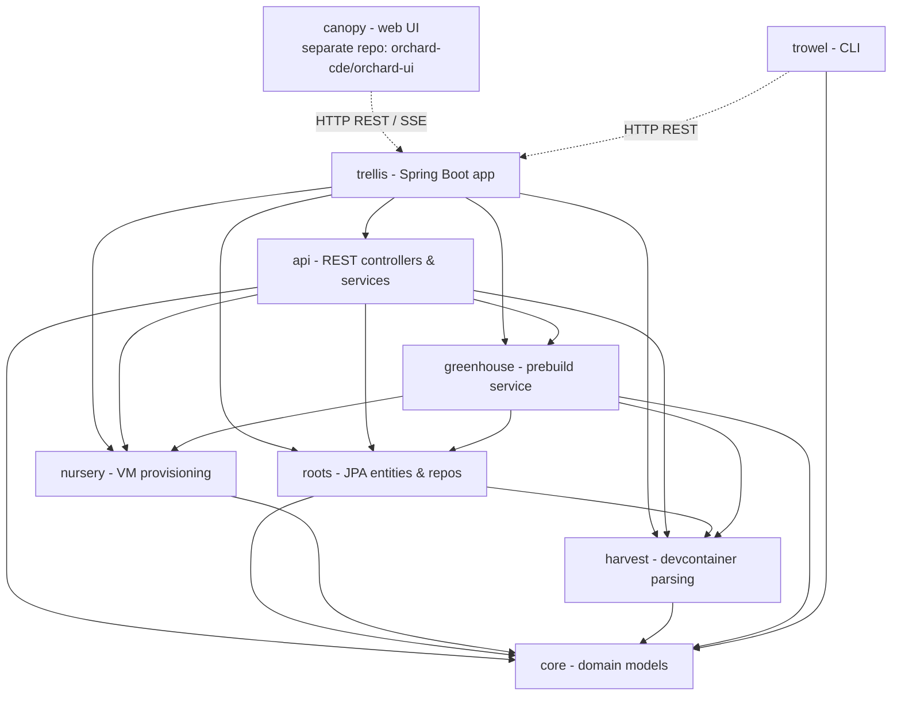
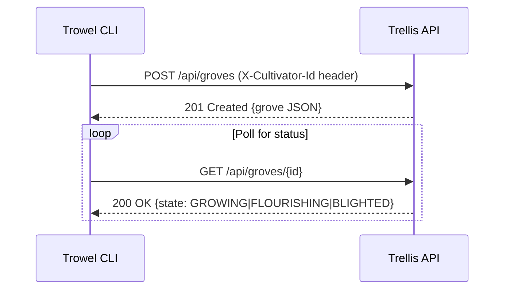
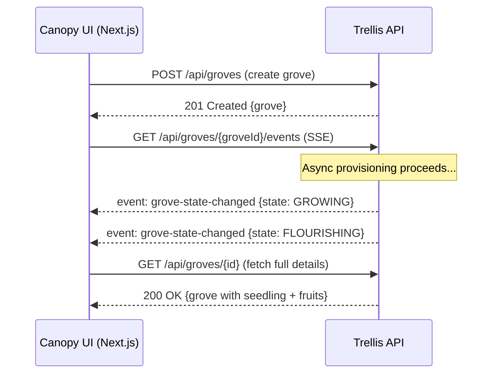
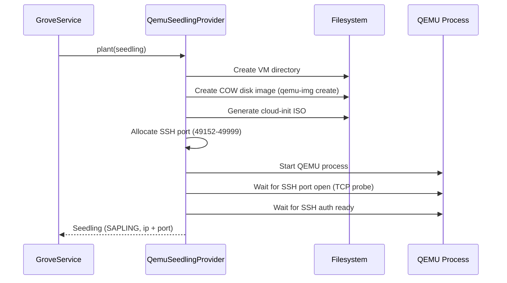
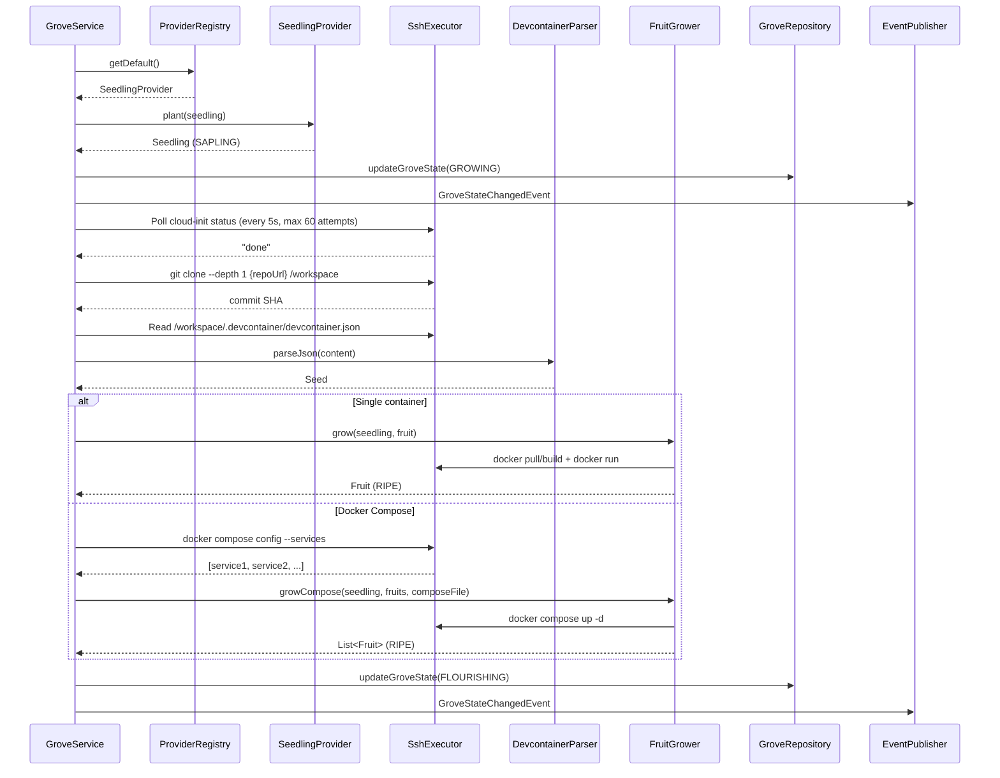
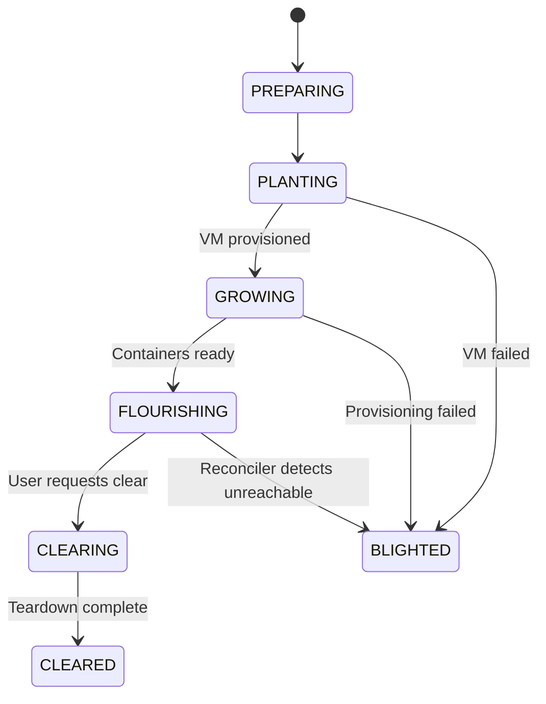
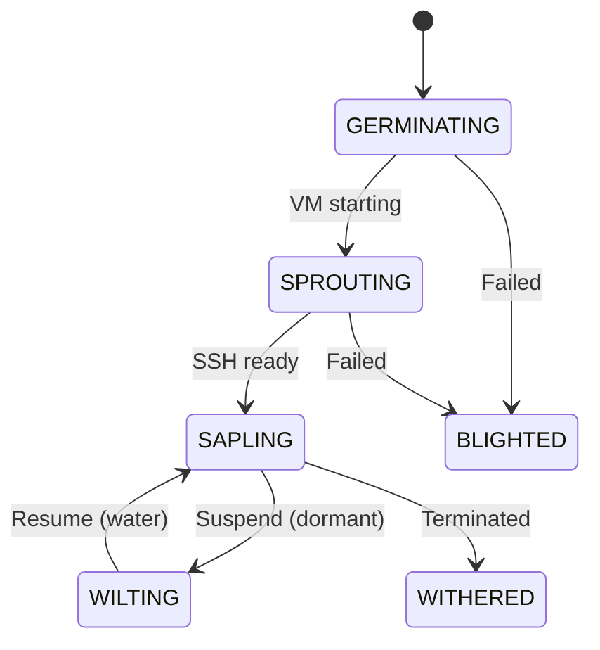
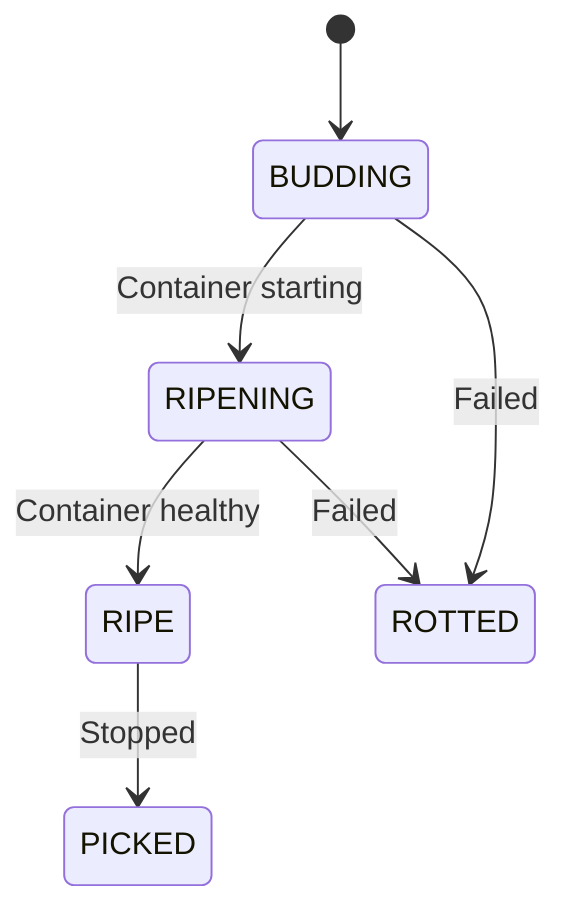
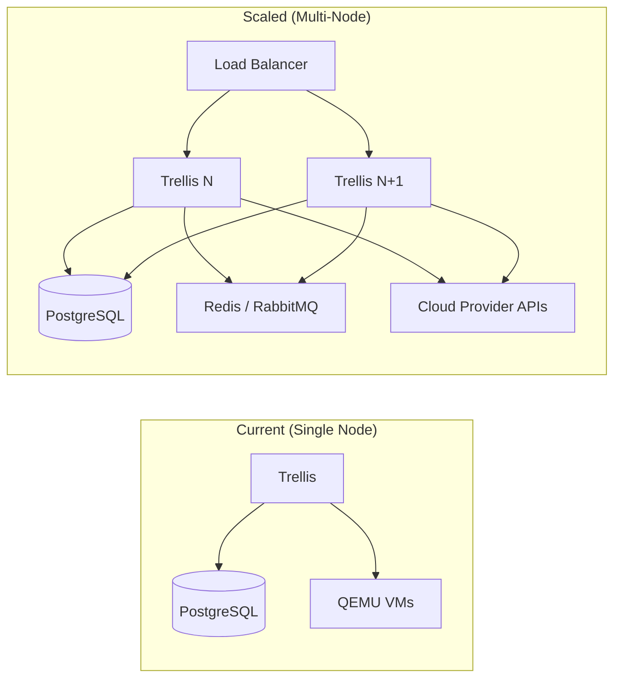

# Orchard Architecture

This document describes the architecture of the Orchard CDE (Cloud Development Environment) platform, focusing on how clients communicate with the backend, how seedling providers are managed, and considerations for scalability.

For the themed naming glossary, see [README.md](../../README.md#themed-glossary).

## Module Dependency Graph



**Key**: Solid arrows are compile-time module dependencies. Dashed arrows are runtime network communication. Canopy is a separate Next.js application in the [`orchard-cde/orchard-ui`](https://github.com/orchard-cde/orchard-ui) repository.

---

## 1. Client-Server Communication

### 1.1 CLI (Trowel) → Backend

Trowel communicates with the Trellis backend over **HTTP/1.1 REST with JSON** payloads.

**Client implementation**: `trowel/src/main/java/dev/orchard/trowel/client/OrchardClient.java`
- Uses Java's `java.net.http.HttpClient` (no external HTTP library)
- 10-second connect timeout
- JSON serialization via Jackson with `JavaTimeModule`

**Authentication**: Every request includes an `X-Cultivator-Id` header containing the cultivator's UUID. This is the dev-mode authentication mechanism.

**Configuration resolution** (highest priority first):
1. CLI flags (`--server`, `--cultivator`)
2. Environment variables (`ORCHARD_SERVER_URL`, `ORCHARD_CULTIVATOR_ID`)
3. Config file (`~/.orchard/config.properties`)
4. Defaults (`http://localhost:8080`)

**API endpoints consumed by Trowel**:

| Command | HTTP Method | Endpoint | Description |
|---------|-------------|----------|-------------|
| `grove plant` | POST | `/api/groves` | Create a new grove |
| `grove list` | GET | `/api/groves` | List cultivator's groves |
| `grove show` | GET | `/api/groves/{id}` | Get grove details |
| `grove clear` | DELETE | `/api/groves/{id}` | Destroy a grove |
| `status` | GET | `/api/health` | Check server health |



### 1.2 Web UI (Canopy) → Backend

Canopy is a **separate Next.js application** in the [`orchard-cde/orchard-ui`](https://github.com/orchard-cde/orchard-ui) repository, built with Next.js 15, React 19, and Material-UI 7 (TypeScript). It communicates with the Trellis backend over two channels:

**REST API** — Same `/api/*` endpoints as Trowel, for CRUD operations.

**Authentication**: Same `X-Cultivator-Id` header as Trowel in dev mode. Configured via environment variables:
- `NEXT_PUBLIC_API_URL` — Trellis backend URL (defaults to `http://localhost:8080`)
- `NEXT_PUBLIC_CULTIVATOR_ID` — Dev-mode cultivator UUID

**Real-time updates — SSE (Server-Sent Events)**

Canopy uses the browser `EventSource` API via a custom `useGroveEvents()` React hook to receive real-time grove state changes.

Backend implementation in `api/src/main/java/dev/orchard/api/controller/GroveEventController.java`:
- **Endpoint**: `GET /api/groves/{groveId}/events` (`text/event-stream`)
- **Event name**: `grove-state-changed`
- **Timeout**: 30 minutes
- Emitters managed via `ConcurrentHashMap<UUID, CopyOnWriteArrayList<SseEmitter>>`

The `useGroveEvents()` hook auto-reconnects with exponential backoff (max 3 retries).

**Message payload** (`GroveStateMessage`):
```json
{
  "groveId": "uuid",
  "groveName": "my-grove",
  "previousState": "GROWING",
  "newState": "FLOURISHING",
  "changedAt": "2026-02-20T12:00:00Z"
}
```

Messages are broadcast by `GroveEventBroadcaster` which listens for Spring `GroveStateChangedEvent` application events.

> **Note**: The Trellis backend also supports WebSocket/STOMP via `/ws/grove-events` (configured in `WebSocketConfig.java`), but Canopy currently uses SSE exclusively.



### 1.3 Authentication Architecture

The platform supports two authentication modes, controlled by `orchard.security.oauth2.enabled`:

**Development mode** (default, `false`):
- `SecurityConfig.permissiveFilterChain()` allows all requests
- Cultivator identity passed via `X-Cultivator-Id` header
- Cultivator auto-created on first API call

**Production mode** (`true`):
- `SecurityConfig.securedFilterChain()` validates JWT tokens
- `/api/health/**`, `/actuator/**`, `/ws/**` are open; `/api/**` requires authentication
- `CultivatorAuthFilter` extracts identity from JWT claims (`sub`, `email`, `preferred_username`, `name`, `picture`)
- Cultivator auto-created via `CultivatorService.findOrCreateCultivator()`
- Cultivator ID stored as request attribute for downstream controllers

---

## 2. Seedling Provider Architecture

### 2.1 SeedlingProvider Interface

Defined in `nursery/src/main/java/dev/orchard/nursery/SeedlingProvider.java`:

```java
public interface SeedlingProvider {
    String getProviderId();
    CompletableFuture<Seedling> plant(Seedling seedling);    // Provision VM
    CompletableFuture<Seedling> water(Seedling seedling);    // Resume stopped VM
    CompletableFuture<Seedling> dormant(Seedling seedling);  // Suspend VM
    CompletableFuture<Void> uproot(Seedling seedling);       // Destroy VM
    CompletableFuture<Seedling> inspect(Seedling seedling);  // Check status
    boolean isAvailable();                                    // Health check
}
```

All operations return `CompletableFuture` for non-blocking async provisioning.

### 2.2 ProviderRegistry

`nursery/src/main/java/dev/orchard/nursery/ProviderRegistry.java`:
- Stores providers in a `ConcurrentHashMap<String, SeedlingProvider>` keyed by provider ID
- Configurable default provider via `orchard.nursery.provider` property
- Short name mapping (e.g., `"qemu"` → `"qemu-local"`, `"aws"` → `"aws-ec2"`) handled in `NurseryConfig.resolveProviderId()`

### 2.3 Available Providers

| Provider | ID | Config Prefix | Conditional On |
|----------|-----|---------------|----------------|
| QEMU (local) | `qemu-local` | `orchard.qemu.*` | Always registered |
| AWS EC2 | `aws-ec2` | `orchard.nursery.aws.*` | `aws.region` is set |
| GCP Compute | `gcp-compute` | `orchard.nursery.gcp.*` | `gcp.project` is set |
| Azure VM | `azure-vm` | `orchard.nursery.azure.*` | `azure.subscription-id` is set |

Cloud providers are conditionally registered via `@ConditionalOnProperty` beans in `trellis/src/main/java/dev/orchard/trellis/config/NurseryConfig.java`.

### 2.4 QEMU Provider Flow

The QEMU provider (`nursery/src/main/java/dev/orchard/nursery/qemu/QemuSeedlingProvider.java`) provisions local VMs:



**Cloud-init provisions the VM with**:
- User `cultivator` with sudo (NOPASSWD)
- SSH public key from `ORCHARD_SSH_PUBLIC_KEY` env or `~/.ssh/orchard_ed25519.pub`
- Packages: `docker.io`, `git`
- `/workspace` directory owned by `cultivator`
- Docker service started, `cultivator` added to `docker` group

---

## 3. Grove Provisioning Flow

### 3.1 End-to-End Sequence

`api/src/main/java/dev/orchard/api/service/GroveService.java`:

**Phase 1 — Synchronous (within transaction)**:
1. Ensure cultivator exists
2. Create `Grove` record (state: `PLANTING`)
3. Create `Seedling` record (state: `GERMINATING`) with spec (small/medium/large)
4. Persist to database
5. Register async callback via `TransactionSynchronization.afterCommit()`

**Phase 2 — Asynchronous (after commit)**:



### 3.2 State Machines

#### Grove States



#### Seedling States



#### Fruit States



### 3.3 Grove Teardown

`GroveService.clearGrove()`:

1. Set grove state to `CLEARING`, persist, register async callback
2. **After commit**: Check VM reachability via TCP socket probe (3s timeout)
3. If reachable: stop and remove all containers via `FruitGrower.compost()`
4. Delete fruit entities from database
5. Terminate VM via `SeedlingProvider.uproot()`
6. Set grove state to `CLEARED`

---

## 4. Container Management (FruitGrower)

`nursery/src/main/java/dev/orchard/nursery/FruitGrower.java`

All container operations are executed remotely via SSH to the seedling VM.

### Single Container Workflow
1. If seed has `image`: `docker pull {image}` then `docker run -d` with env vars, port forwards, workspace mount at `/workspace`
2. If seed has `dockerfilePath`: `docker build -t {name} -f {path} /workspace` then `docker run`
3. Extract port mappings via `docker port`
4. Execute `postCreateCommands` via `docker exec`

### Docker Compose Workflow
1. Discover services: `docker compose -f {path} config --services`
2. Create a `Fruit` record per service (primary service first)
3. Start all: `docker compose -f {path} up -d`
4. Match running containers to fruits by service name via `docker compose ps`
5. Execute `postCreateCommands` on the primary service container

### SSH Execution

All remote commands go through `SshExecutor`:
- Invokes the local `ssh` binary via `ProcessBuilder`
- Options: `StrictHostKeyChecking=no`, `UserKnownHostsFile=/dev/null`, `ConnectTimeout=10`
- Key: `~/.ssh/orchard_ed25519`
- Connects as user `cultivator` on the seedling's IP and SSH port

---

## 5. Startup Reconciliation

`trellis/src/main/java/dev/orchard/trellis/GroveReconciler.java`

Runs on application startup via `ApplicationRunner`:

| Previous State | Action | New State |
|---------------|--------|-----------|
| `FLOURISHING` + VM reachable | Leave as-is | `FLOURISHING` |
| `FLOURISHING` + VM unreachable | Mark failed | `BLIGHTED` |
| `PREPARING`, `PLANTING`, `GROWING` | Stuck from previous run | `BLIGHTED` |
| `CLEARING` | Interrupted teardown | `CLEARED` |

---

## 6. Prebuild Architecture (Greenhouse)

The `greenhouse` module provides pre-built container images to reduce grove provisioning latency:

- **PrebuildService**: Orchestrates image building from devcontainer specs
- **ImageBuilder**: Builds Docker images and pushes to a registry
- **PrebuildScheduler**: Periodically refreshes pre-built images
- **GreenhouseAutoConfiguration**: Spring Boot auto-configuration for the module

When a grove is provisioned and a matching prebuild exists, the container image is pulled from the registry instead of being built from scratch on the VM.

---

## 7. Scalability and Performance Considerations

### Current Architecture Constraints

| Constraint | Detail |
|-----------|--------|
| **Single instance** | Trellis runs as a single Spring Boot process. No clustering. |
| **In-memory process tracking** | `QemuSeedlingProvider` tracks VM processes in a `ConcurrentHashMap<UUID, Process>`, lost on restart (reconciler compensates). |
| **In-memory message broker** | STOMP uses Spring's simple in-memory broker. SSE emitters are also in-memory. |
| **SSH-based execution** | All VM interaction forks a local `ssh` process per command. No persistent connections or agent. |
| **Virtual threads** | `FruitGrower` and `QemuSeedlingProvider` use `Executors.newVirtualThreadPerTaskExecutor()` for concurrent provisioning. |

### Horizontal Scaling Path



**Key changes needed for horizontal scaling**:

1. **External message broker**: Replace the in-memory STOMP broker with Redis or RabbitMQ so WebSocket messages are broadcast across all Trellis instances.

2. **Cloud providers over QEMU**: QEMU requires local process management. Cloud providers (EC2, GCE, Azure) use stateless API calls that work from any Trellis instance. State is already persisted in PostgreSQL.

3. **SSH connection management**: Consider SSH connection pooling or a persistent agent running on VMs to reduce overhead from forking `ssh` processes per command.

4. **Database**: PostgreSQL supports read replicas for scaling read traffic. No sharding needed at typical CDE scale (hundreds to low thousands of groves).

5. **Prebuild distribution**: Container registry becomes a shared resource. Greenhouse builds can be offloaded to a dedicated worker or CI pipeline.

### Performance Characteristics

| Phase | Typical Latency | Bottleneck |
|-------|----------------|------------|
| API response (plantGrove) | < 100ms | Synchronous — returns immediately |
| VM boot (QEMU) | 30-60s | QEMU process startup + SSH readiness |
| Cloud-init | 1-3 min | Package installation (docker, git) |
| Repository clone | 5-30s | Network speed + repo size |
| Container pull/build | 30s-2 min | Image size + registry speed |
| **Total provisioning** | **2-5 min** | Cloud-init dominates |

**Optimizations available**:
- Prebuilds (Greenhouse) eliminate container build time
- Custom VM images with docker/git pre-installed eliminate cloud-init wait
- Shallow clones (`--depth 1`) already used to minimize clone time
- Virtual threads prevent thread pool exhaustion under concurrent provisioning

### Reliability Mechanisms

| Mechanism | Purpose |
|-----------|---------|
| `TransactionSynchronization.afterCommit()` | Ensures DB row exists before async provisioning begins |
| `GroveReconciler` | Catches stuck/orphaned groves on startup |
| VM reachability check | TCP probe before attempting container cleanup during teardown |
| Fallback devcontainer | Default Ubuntu image + ports if no devcontainer.json found |
| `FAIL_ON_UNKNOWN_PROPERTIES=false` | Forward-compatible JSON parsing in CLI |
